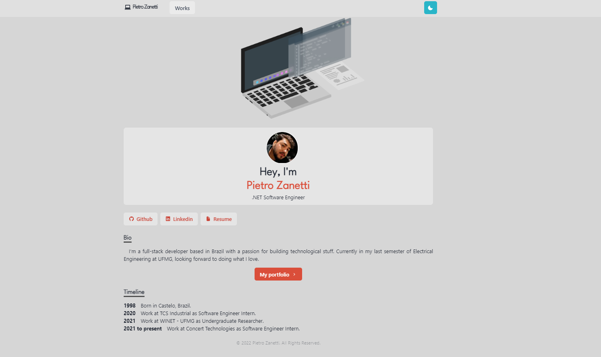

# Portfolio

## :page_with_curl: About

Web project developed for personal professional profile presentation

## :computer: Technologies

-  [Next.js](https://nextjs.org/) - A React framework with hybrid static & server rendering, and route pre-fetching, etc.
-  [Chakra UI](https://chakra-ui.com/) - A simple, modular and accessible component library for React
-  [Three.js](https://threejs.org/) - 3D library for JavaScript
-  [Framer Motion](https://www.framer.com/motion/) - An animation library for React

 

    
  

